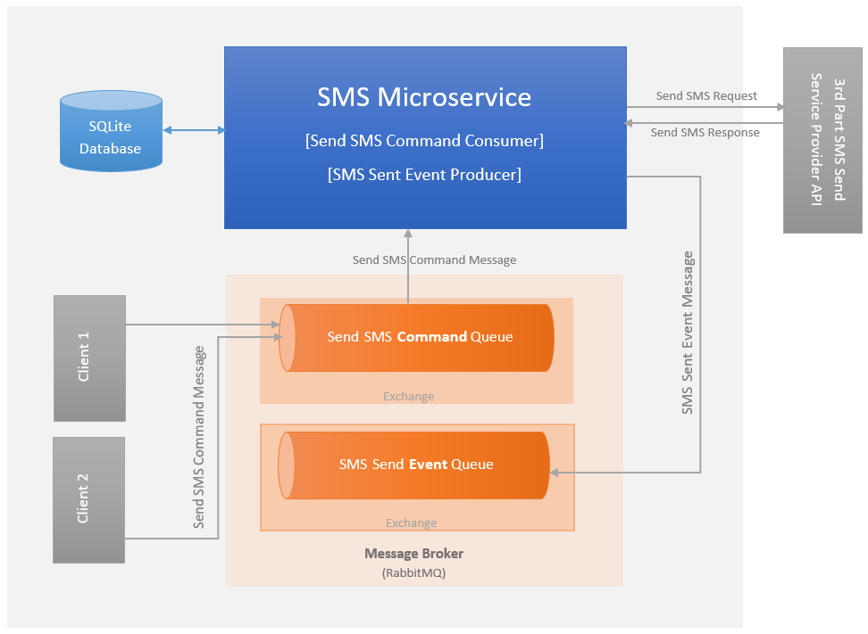

# Backend Exercise: SMS Microservice

### Content
- [Overview](#Overview-)
- [Project Objectives](#Project-Objectives-)
- [Project Coverage](#Project-Coverage-)
- [Design Features](#Design-Features-)
  - [Use Cases](#Use-Cases-)
  - [Architecture Diagram](#Architecture-Diagram-)
  - [Dependencies](#Dependencies-)
- [Usage](#Usage-)
---

## Overview 
The project develops a simple microservice that functions as a wrapper around the API of a third-party SMS service. An SMS service client issues a "send" command to the SMS Service, which then processes the request. The SMS service selects a 3rd Party SMS Service Provider based on the "country" property of the SMS message. After the SMS message is sent to the 3rd party SMS service provider, the service emits an "SMS Sent" event to the broker, which can then be consumed by its subscribers.

## Project Objectives 
* Developing an abstract solution for future use, integration, and enhancement.
* Using Asynchronous Communication: Despite its greater complexity compared to synchronous communication, asynchronous communication enhances resiliency by managing failures without hindering ongoing processes. In this project, an abstraction to use asynchronous communication was created. 
* Using Synchronous Communication: When interacting with external systems, synchronous communication offers the advantage of immediate interaction and feedback. In this project, an abstraction to use synchronous communication was created.

  
## Project Coverage 
* The project creates an abstraction layer for a potential SMS Microservice, ensuring that the tools used in this project are configured with basic, essential settings.
* The recommended zero-trust pattern in a microservices architecture involves the use of encrypted connections, SSL protocol, and authentication across services and platforms. For simplicity, this project does not implement the zero-trust pattern.
* In asynchronous communication, it’s important to address negative scenarios, such as unconsumed messages, using various techniques. One such technique involves using a dead-letter queue at the broker level, coupled with dead-letter processing logic within applications. In this project, although the distributed application framework automatically creates dead-letter queues, operations for handling these queues have been deliberately excluded for simplicity.
* Integration tests are not included in this project as its primary objective is to provide an abstract solution intended for later integration tasks.
* Unit tests don't cover the whole application due to time limitations.
* The 3rd party SMS sender provider API was created as a prototype for demonstration purposes.
* Observability patterns and error handling patterns are not included in the project for simplicity. Only local (not integrated with observability pattern) error-handling scenarios are implemented.
* A toggle pattern that is used in conjunction with the options pattern would help an application to be more flexible in responding to new requirements. This pattern is not applied due to simplicity purposes.

## Design Features 
* The project follows the clean architecture approach.
* Options pattern is selected for their DevOps-friendly features.
* While using generic classes is an option, thinking that every third-party SMS sender service can have its own connection structure, behavior, and message types, the factory pattern has been chosen to create SMS sender classes instead of using generic classes.
* The containerization approach is used in the project. 
  
  ### Use Cases 
  * When a client sends a "Send SMS" command to the broker, the "SMS Service" handles the message and checks if that message has already been received and processed considering the message ID and the time it was received by querying the database table.
    * Non-Duplicate Message Case:
      - If the message doesn't exist in the database, which also means that there is no message duplication, the "SMS Service" saves the message into the database.
      - The service prepares an SMS send service provider-specific SMS request, and it generates an SMS send service provider-specific sender service internally. The service makes a RESTful request to the 3rd part SMS send service provider and handles the response immediately. It's assumed that the response is successful in this case. The negative case is not covered for simplicity.
      - Based on the response status, if the response is successful, the service sends an "SMS Send Event" to the broker to be consumed by its subscribers. Subscribers are not demonstrated in this project.
   * Duplicate Message Case:
       - When a duplicate message is received, the service logs the case and takes no action.

  ### Architecture Diagram 
    
  
  ### Dependencies 
  * .Net Core 7.0
  * Entity Framework Core 7.0
  * MassTransit (Distributed application framework for .NET)
  * RabbitMQ (Message Broker that works with MassTransit. Note: MassTransit also provides an in-memory broker.)
  * Serilog
  * Fluent Validation
  * Moq
  * Docker Desktop

### Usage 
* **Prerequisite**
    * You should have Docker Desktop installed on your operating system in order to run this application.
      (Refer To: https://docs.docker.com/compose/install/#scenario-one-install-docker-desktop)
* Start Docker Desktop.
* Open the command window.
* Locate in the application solution folder that contains the docker-compose.yml file.
* Run `docker compose up --build --always-recreate-deps` command to start all containers.
* Observe the Output logs.
* Browse the RabbitMQ GUI default local page (http://localhost:15672/), use credentials of username as guest and password as guest at and observe that messages are transitioning from producers to consumers.
  (Note: As there is no consumer exists for "SMS Message Sent Event" in the project scope, when messages are not consumed, the application comprehends it as a failure and executes a redelivery action for all pending event messages.)
* Run `docker compose down` command to stop the applications contained in the docker-compose structure.

